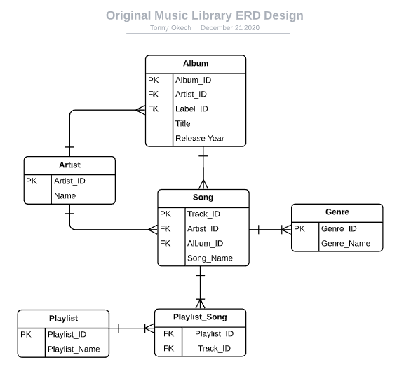
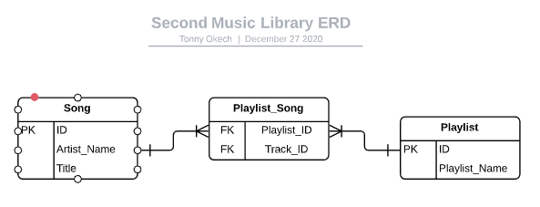
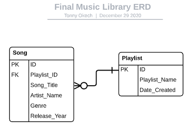
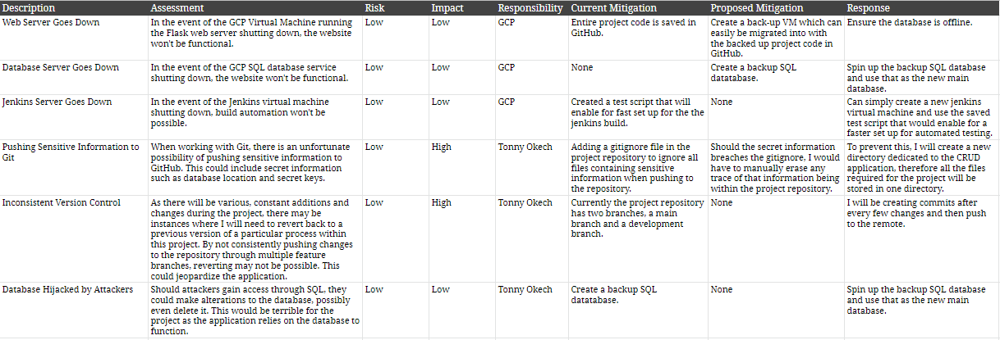
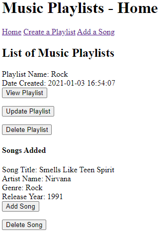
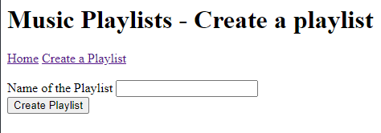
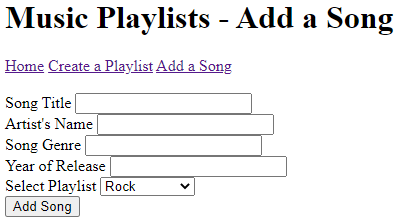
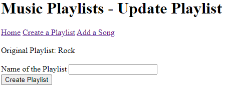

# Music Playlist App

## Contents
This is where all the documentation for the project will be:

### Introduction
### Brief
To create a CRUD application with utilisation of supporting tools,
methodologies and technologies that encapsulate all core modules
covered during training.

In order to do this, the follwowing is required:
- Trello board or equivalent with a full project backlog 
- Relational database compromising at least two tables 
- Clear documentation highlighting the architecture of the project
- A comprehensive risk assessment
- Fully designed test suites including automated testing
- Functioning CRUD application created in Python
- Functioning front-end website created in Flask
- Full integration into GitHub

#### My Proposition
To achieve this, I decided to create a simple music playlist application that allows users to create playlists and add, update and delete songs within those playlists.
The application must allow the user to do the following:
- Create:
  - Playlist
    - Playlist Name
  - Songs
    - Song Title
    - Artist Name
    - Genre
    - Release Year
    - Allocate to a Playlist
- Read:
  - Created Playlists
- Update:
  - Playlists
    - Playlist Name
- Delete:
  - Songs from playlists
  - Playlists

## Architecture
### Database Structure
In order to create the Music Playlist app, a database was required in order to store data. Regarding this project, the data to be stored is music playlists and songs. Therefore the two main entities in the diagram were Playlist and Song. 

##### Below is the original entity relationship diagram (ERD) showcasing the structure of the database:

##### The second ERD can be found below:

##### The final ERD:

The main reason for the changes made to the ERD is due lack of time to create all of the functionality for the original design. This will be explained in further detail in the 'Future Improvements' section at the end of this document.

### Project Tracking
For project tracking, I chose Trello as my tool of choice due to previous experiences using it and its lightweight, interactive UI makes the proces much simpler. This is where the project backlog is stored, highlighting each individual task broken down from the project epic. User stories have also been documented to emphasise the key functions expected from the CRUD application from the user's perspective.

### Risk Assessment
A risk assessment was created in order to monitor and plan for any potential risks that could jeaopardize the project. This proactive approach to implement the risk assessment could prevent the majority of incidents that could possibly occur during the project and minimises the likelihood and impact of those incidents.
This is the original risk assessment created during the planning stages of the project:

The final risk assessment for this project can be located here:

Additions were made to the final risk assessment during the latter stages of the project as it became clear that more issues could arise the further I went into development.

## Development
### Front End Design
#### Home Page

  
This is the application's homepage.

#### Create Playlist

  
The create page allows users to create a simple playlist with a name of their choosing.

#### Add Song

  
This page allows users to add song to a specific playlist using a dropdown menu.

#### Update Playlist

  
This page allows users to update playlist's names.

### Testing
#### Unit Testing
The unit testing was used to test each function within the route. The tests were designed to verify whether data is correctly inserted into the application whilst also checking if unexpected or incorrect values have been inserted. Furthermore, with the utilisation of Webhooks through Github, the unit tests are run automatically in Jenkins after each push to the project repository in Github. Upon completion of the tests built in Jenkins, a coverage report is also returned to the console with further information about the tests.

### Future Improvements

### Author
###### Tonny Allen Okech
